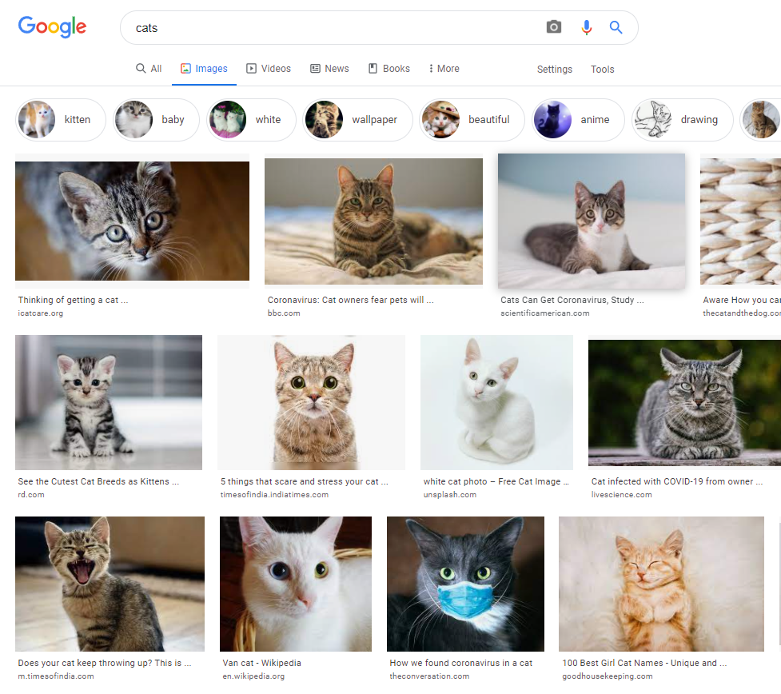

You have to create a simple image search engine using Giphy API.

The app should use the following API https://developers.giphy.com/branch/master/docs/api/endpoint/. It should retrieve and display list of images based on user's input.

Build smth like this.

